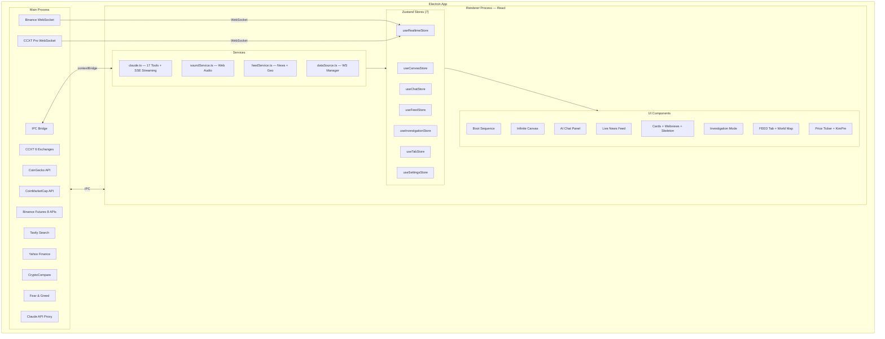

# TRAVIS — Shape Your Market

> AI-powered cryptocurrency trading intelligence platform.
> Ask anything, see everything on your canvas.

---

## What is TRAVIS?

TRAVIS is an AI-powered trading intelligence desktop app that unifies **real-time market data**, **breaking news**, **on-chain analytics**, and **AI analysis** into a single infinite canvas workspace. Instead of switching between 10+ tabs (TradingView, Twitter, CoinGecko, news sites), traders type natural language commands and TRAVIS spawns interactive information cards, live charts, and embedded websites — automatically connecting related data points using **Mosaic Theory**.

"BTC 김프 얼마야?" 한 마디로 김치 프리미엄 현황, 거래소별 가격 비교, 실시간 차트가 캔버스에 펼쳐집니다.

Built on the principle that *"the tile AI skipped might be the one that makes you rich"*, TRAVIS shows **everything** and uses AI to score relevance — never filtering. The raw feed is always available. The AI highlights what matters, but the trader decides.

---

## Key Features

### AI-Powered Analysis (17 AI Tools)
- **실시간 코인 데이터** — 어떤 코인이든 이름만 말하면 자동 조회 (Dynamic Symbol Resolution via CoinGecko)
- **6개 거래소 동시 지원** — Binance, Upbit, Bybit, Bithumb, OKX, Coinbase (CCXT)
- **선물 데이터** — 펀딩비, OI, 롱숏비율, 청산 내역 (Binance Futures 8개 API)
- **고래 탐지** — 대형 거래, 호가벽 감지
- **트렌딩** — 실시간 인기 코인 / 카테고리
- **김치 프리미엄** — Upbit vs Binance 실시간 비교
- **CoinMarketCap 보조** — 카테고리 분류, 시총 순위, 신규 상장
- **웹 검색** — Tavily API로 최신 뉴스/이벤트 실시간 검색

### Interactive Canvas
- **멀티카드 동시 생성** — 한 번의 질문에 분석 카드 + 뉴스 + 차트가 동시에 펼쳐짐
- **스켈레톤 카드** — 로딩 중에도 즉각적인 피드백 (shimmer → content transition)
- **Investigation Mode** — 카드 더블클릭으로 전체화면 분석 대시보드, AI 동적 패널 추가/제거
- **웹뷰 제어** — AI가 TradingView 차트 심볼/타임프레임 직접 변경
- **Node-Edge 연결선** — 관련 카드 간 자동 연결, hover-reveal

### Real-time Data
- **Binance WebSocket** — 실시간 스팟 시세 스트리밍
- **CCXT Pro WebSocket** — 6개 거래소 실시간 시세/대형체결 (lazy connection, 5min idle disconnect)
- **뉴스 피드** — CryptoCompare 뉴스 + AI 스코어링 (Haiku)
- **World Map** — 뉴스 지리 태깅 + 글로벌 이벤트 지도
- **Price Ticker** — BTC, ETH, SOL + S&P500, NASDAQ, DXY, GOLD, OIL 스크롤 시세

### Sound & UX
- **사운드 피드백** — 부팅, 카드 스폰, AI 응답 시 사이버펑크 전자음 (Web Audio API)
- **SSE 타임아웃** — 60초 무응답 시 자동 복구
- **에러 복원력** — API 자동 재시도 (exponential backoff)
- **시네마틱 부팅** — JARVIS 스타일 부트 시퀀스

---

## Tech Stack

| Layer | Technology | Purpose |
|-------|-----------|---------|
| **Desktop** | Electron 33 | Cross-platform app, webview, IPC |
| **Frontend** | React 18 + TypeScript | Component architecture, type safety |
| **Styling** | TailwindCSS | Utility-first CSS, dark theme |
| **State** | Zustand | Lightweight reactive stores (7 stores) |
| **AI** | Claude API (Sonnet + Haiku) | Streaming chat, 17 tools, news scoring |
| **Exchanges** | CCXT + CCXT Pro | 6 exchanges REST + WebSocket |
| **Market Data** | CoinGecko + CoinMarketCap | Coin data, global metrics, trending |
| **Real-Time** | Binance WebSocket + CCXT Pro WS | Live price/volume/funding streams |
| **Search** | Tavily API | AI web search |
| **Charts** | TradingView (webview) | Interactive candlestick charts |
| **Maps** | react-simple-maps | World map with D3-geo |
| **Sound** | Web Audio API | Procedural sound effects |
| **Build** | Vite + electron-builder | Fast HMR dev, production packaging |
| **Fonts** | JetBrains Mono + Rajdhani | Data display + military-style headers |

---

## Installation

### Prerequisites
- **Node.js** 18+ and **npm**
- **Claude API Key** ([console.anthropic.com](https://console.anthropic.com))
- **Tavily API Key** ([tavily.com](https://tavily.com))

### Setup

```bash
git clone https://github.com/dai-juju/TRAVIS-v1.git
cd TRAVIS-v1
npm install
```

### Run

```bash
npm run dev      # Development (Electron + Vite HMR)
npm run build    # Production build
```

---

## Configuration

On first launch, click the **gear icon** in the chat panel header:

| API Key | Required | Purpose | Get it |
|---------|----------|---------|--------|
| Claude API Key | Required | AI chat + analysis + tool use | [Anthropic Console](https://console.anthropic.com) |
| Tavily API Key | Required | Web search | [Tavily](https://tavily.com) |
| CoinMarketCap API Key | Optional | Supplementary data (rank, categories) | [CMC API](https://coinmarketcap.com/api/) |

All keys are stored locally and only sent to their respective APIs.

---

## AI Tools (17)

### Display Tools (7)
| Tool | Description |
|------|-------------|
| `spawn_card` | 정보 카드 생성 (마크다운, 이미지, 심볼 구독) |
| `spawn_webview` | 웹사이트 캔버스 임베드 |
| `spawn_multiple_cards` | 복수 카드+웹뷰 동시 생성 (그리드 배치 + 자동 연결선) |
| `remove_cards` | 카드 삭제 |
| `rearrange` | 카드 재배치 (grid / stack) |
| `update_card` | 기존 카드 내용 수정 |
| `control_webview` | 웹뷰 URL/크기/TradingView 심볼·인터벌 변경 |

### Data Tools (8)
| Tool | Description |
|------|-------------|
| `fetch_coin_data` | 코인 종합 (CoinGecko + Binance + CMC). 선물 데이터 포함 옵션 |
| `fetch_market_overview` | 시장 전체 (글로벌 시총, BTC 도미넌스, F&G, Top 상승/하락) |
| `fetch_derivatives_data` | 선물 8개 API (펀딩비, OI, 롱숏, 청산) |
| `fetch_whale_activity` | 고래 대형 체결 + 호가벽 |
| `fetch_trending` | 트렌딩 코인/NFT/카테고리 |
| `fetch_exchange_price` | 특정 거래소 가격 (6거래소) |
| `compare_exchange_prices` | 멀티 거래소 비교 + 김치 프리미엄 |
| `search_web` | Tavily 웹 검색 |

### Analysis Tools (2)
| Tool | Description |
|------|-------------|
| `open_investigation` | Investigation Mode 전체화면 분석 |
| `update_investigation` | 패널 동적 관리 (추가/제거/수정/순서변경/초기화) |

---

## Project Structure

```
src/
├── main/                         # Electron main process
│   ├── index.ts                  # App entry, window creation
│   ├── ipc.ts                    # IPC handler registration (25+ handlers)
│   ├── preload.ts                # Secure contextBridge (25+ methods)
│   ├── tavily.ts                 # Tavily web search
│   ├── binanceApi.ts             # Binance REST (trades, klines)
│   ├── binanceFuturesApi.ts      # Binance Futures (funding, OI)
│   ├── coingeckoApi.ts           # CoinGecko (coin data, search)
│   ├── upbitApi.ts               # Upbit Kimchi Premium
│   ├── yahooFinance.ts           # Traditional asset quotes
│   ├── feedApi.ts                # CryptoCompare news, Fear & Greed
│   ├── api/                      # Phase 3A API modules
│   │   ├── coinDataApi.ts        # CoinGecko + Binance coin data
│   │   ├── marketOverviewApi.ts  # Global metrics + F&G
│   │   ├── derivativesApi.ts     # Futures derivatives (8 APIs)
│   │   ├── whaleApi.ts           # Large trades + order book
│   │   ├── trendingApi.ts        # Trending coins
│   │   ├── symbolResolverApi.ts  # Dynamic symbol resolution
│   │   ├── exchangeService.ts    # CCXT 6-exchange service
│   │   ├── cmcApi.ts             # CoinMarketCap API
│   │   └── utils/
│   │       └── fetchWithRetry.ts # Retry with exponential backoff
│   └── services/
│       └── exchangeWsService.ts  # CCXT Pro WebSocket service
├── renderer/                     # React frontend
│   ├── App.tsx                   # Root: Boot → TabSystem → Content
│   ├── components/
│   │   ├── BootSequence.tsx      # Cinematic startup animation
│   │   ├── Canvas.tsx            # Infinite pan/zoom canvas
│   │   ├── ChatPanel.tsx         # AI chat + streaming + card focus
│   │   ├── Card.tsx              # Info card (markdown, skeleton, price flash)
│   │   ├── WebviewCard.tsx       # Embedded website + webviewRefs registry
│   │   ├── InvestigationMode.tsx # Dynamic panel grid
│   │   ├── InvestigationPanel.tsx# Panel router + dynamic panel UI
│   │   ├── InvestigationChart.tsx# TradingView chart
│   │   ├── InvestigationWhale.tsx# Large trades table
│   │   ├── InvestigationOnchain.tsx # CoinGecko market data
│   │   ├── InvestigationSector.tsx  # Sector comparison
│   │   ├── InvestigationNews.tsx    # Symbol-filtered news
│   │   ├── SpawnAnimation.tsx    # Card spawn effects
│   │   ├── TabBar.tsx            # COMMAND / FEED tabs
│   │   ├── NewsFeed.tsx          # Left-side breaking news
│   │   ├── FeedItem.tsx          # Single feed item
│   │   ├── MosaicFeed.tsx        # FEED tab layout
│   │   ├── MultiColumnFeed.tsx   # 7-column raw feed
│   │   ├── FeedSidebar.tsx       # Feed sidebar with filters
│   │   ├── FeedColumn.tsx        # Single category column
│   │   ├── WorldMap.tsx          # World map with event pins
│   │   ├── EventCalendar.tsx     # Economic/crypto calendar
│   │   ├── EdgeLayer.tsx         # SVG edge layer
│   │   ├── NodeEdge.tsx          # Connection lines
│   │   ├── PriceTicker.tsx       # Bottom ticker + Kimchi Premium
│   │   ├── StatusBar.tsx         # Connection status
│   │   ├── LatencyIndicator.tsx  # Data freshness indicator
│   │   └── SettingsModal.tsx     # API keys + model config
│   ├── services/
│   │   ├── claude.ts             # Claude API, 17 tools, streaming
│   │   ├── dataSource.ts         # DataSource interface + manager
│   │   ├── binanceWs.ts          # Binance WebSocket
│   │   ├── feedService.ts        # News aggregation + geo-tagging
│   │   ├── scoringService.ts     # AI relevance scoring (Haiku)
│   │   └── soundService.ts       # Sound feedback (Web Audio API)
│   ├── stores/
│   │   ├── useCanvasStore.ts     # Cards, edges, viewport, webview
│   │   ├── useChatStore.ts       # Messages, streaming state
│   │   ├── useSettingsStore.ts   # API keys, model, context
│   │   ├── useRealtimeStore.ts   # WebSocket state, live tickers
│   │   ├── useInvestigationStore.ts # Investigation panels
│   │   ├── useTabStore.ts        # Active tab state
│   │   └── useFeedStore.ts       # News items, filters
│   ├── types/
│   │   └── index.ts              # Shared TypeScript types
│   └── utils/
│       └── geoKeywords.ts        # Location extraction
└── docs/
    ├── spec.md                   # Feature specification
    ├── plan.md                   # Development roadmap
    └── current-task.md           # Current status
```

---

## Architecture



---

## Roadmap

| Phase | Description | Status |
|-------|-------------|--------|
| **Phase 1** | Core Platform (Canvas + Chat + Cards + WebSocket) | Done |
| **Phase 2** | Mosaic Intelligence (Tabs + News + Feed + Map + Calendar) | Done |
| **Phase 3A** | AI Tool Arsenal + Speed (17 tools, 6 exchanges, sound, skeleton) | **Done** |
| **Phase 3B** | Personalization + Memory (onboarding, profile, SQLite, i18n) | Planned |

### Phase 1: Core Platform (8 tasks)
- Project setup, boot sequence, infinite canvas, Claude API integration
- Card rendering + cinematic spawn, webview embedding
- Binance WebSocket real-time data, Investigation Mode

### Phase 2: Mosaic Intelligence Platform (17 tasks)
- Design system migration, tab system, node-edge connections, price ticker
- Breaking news feed + AI scoring, FEED tab with world map
- SSE streaming, Investigation Mode upgrade, Binance Futures, Kimchi Premium

### Phase 3A: AI Tool Arsenal + Perceived Speed (17 tasks)
- Dynamic symbol resolution, 10 new data/display tools
- CCXT 6-exchange integration + WebSocket
- CoinMarketCap supplementary data
- Skeleton cards, sound feedback, SSE/tool timeouts, fetchWithRetry
- Investigation dynamic panels, webview control

### Phase 3B: Personalization + Memory (planned)
- Onboarding wizard, user profile system
- SQLite episodic memory, canvas save/restore
- Session summary, custom definitions learning
- i18n (Korean/English), news translation

---

## License

Private — All rights reserved.

---

**TRAVIS — Shape Your Market.**
