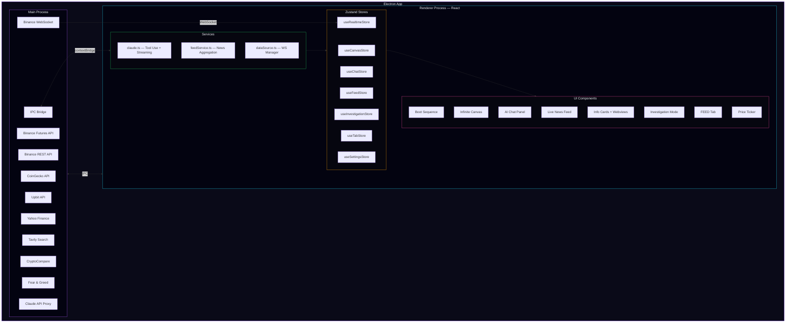
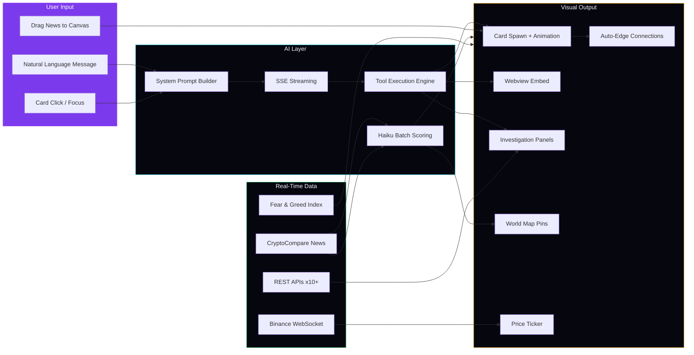

# TRAVIS — Shape Your Market

> **AI-Powered Mosaic Intelligence Platform for Trading**
>
> Natural language in, actionable intelligence out. TRAVIS transforms how traders consume, connect, and act on market information — all in one cinematic desktop environment.

---

## What is TRAVIS?

TRAVIS is an AI-powered trading intelligence desktop app that unifies **real-time market data**, **breaking news**, **on-chain analytics**, and **AI analysis** into a single infinite canvas workspace. Instead of switching between 10+ tabs (TradingView, Twitter, CoinGecko, news sites), traders type natural language commands and TRAVIS spawns interactive information cards, live charts, and embedded websites — automatically connecting related data points using **Mosaic Theory**.

Built on the principle that *"the tile AI skipped might be the one that makes you rich"*, TRAVIS shows **everything** and uses AI to score relevance — never filtering. The raw feed is always available. The AI highlights what matters, but the trader decides.

**Target users**: Crypto traders, quantitative analysts, and fund managers who need to process large volumes of cross-market data quickly.

### How is TRAVIS different?

| | TradingView | ChatGPT | Bloomberg Terminal | **TRAVIS** |
|---|---|---|---|---|
| Real-time data | Charts only | None | Full | Full + AI-enhanced |
| AI analysis | None | Text only | Limited | Streaming + tool use |
| Visual workspace | Single chart | Chat thread | Fixed layout | Infinite canvas |
| News integration | Separate | Manual | Built-in | Auto-scored + geo-tagged |
| Cross-data connections | Manual | None | Manual | **AI auto-edges** |
| Price | $15-60/mo | $20/mo | $24K/yr | **Open source** |

---

## Screenshots


*COMMAND Tab: 3-panel layout with breaking news feed (left), infinite canvas with AI-spawned cards (center), and streaming AI chat (right)*


*FEED Tab: Global event map with geo-tagged news pins, economic calendar, and 7-category raw feed columns*


*Investigation Mode: TradingView chart, filtered news, whale activity, on-chain data, sector comparison, and overview with derivatives*


*Cinematic boot sequence with orbital ring animation and system initialization*

---

## Architecture



---

## Data Flow



---

## Key Features

### AI Mosaic Intelligence
Multiple public information sources — news, prices, on-chain data, derivatives, social signals — unified on one canvas. AI connects the dots using **Mosaic Theory**: individual tiles are public, but the combination reveals non-obvious alpha.

### Real-Time Data Pipeline
**12+ live data sources** feeding into one platform:
- Binance WebSocket (spot prices, volume, 24h stats)
- Binance Futures REST (funding rate, mark price, open interest)
- Upbit Kimchi Premium (KRW/USD arbitrage spread)
- CoinGecko (market cap, supply, performance metrics)
- CryptoCompare (breaking crypto news)
- Alternative.me (Fear & Greed Index)
- Yahoo Finance proxy (S&P 500, NASDAQ, DXY, GOLD, OIL)
- Tavily (AI web search for current events)
- TradingView (embedded charts via webview)

### Global Event Map
Breaking news auto-tagged with geographic coordinates and displayed on a dark-themed world map. Pins pulse on arrival, color-coded by severity (critical/alert/signal/info). Click any pin to see details or push to the COMMAND canvas.

### Investigation Mode
Double-click any card to enter a full-screen **6-panel analysis dashboard**:
| Panel | Source | Content |
|-------|--------|---------|
| Overview | Binance WS + Futures | Price, volume, 24h stats, funding rate, OI |
| Chart | TradingView | Full interactive candlestick chart |
| News | CryptoCompare | Symbol-filtered breaking news |
| Whale Activity | Binance REST | Large trades ($100K+ threshold) |
| On-chain Data | CoinGecko | Market cap, supply, ATH, performance |
| Sector Compare | Binance REST | Peer comparison within sector |

Each panel loads independently (Promise.allSettled) — one failure never blocks the others.

### AI Streaming Chat
Claude API with **SSE streaming** — characters appear in real-time with a typing cursor. The AI has 7 tools: `spawn_card`, `spawn_webview`, `remove_cards`, `rearrange`, `update_card`, `open_investigation`, `search_web`. Multi-turn tool use chains enable complex analysis workflows.

### Webview Intelligence
Embedded websites (TradingView, Binance, CoinGecko, etc.) are **live-monitored**: TRAVIS captures the page title and URL as the user navigates, injects this context into the AI system prompt (`[OPEN WEBVIEWS]`), and auto-creates speculative edge connections to related canvas cards.

### AI News Scoring
Every incoming news item is batch-scored by Claude Haiku for relevance to the trader's context prompt. Scores (0-100) appear as subtle bars on each feed item. **AI scores, never filters** — all items remain visible.

### Kimchi Premium Monitor
Real-time Korean market premium indicator in the price ticker. Compares Upbit KRW prices against Binance USD prices via live exchange rates. Color-coded: green (<1%), amber (1-3%), red (>3%).

### Node-Edge Connections
Cards on the canvas are connected by **hover-reveal edges** showing relationships. Edges are created automatically by AI (via `relatedTo`), by webview content matching, and by drag-from-feed. Hidden by default to keep the canvas clean — hover or click to reveal.

---

## Tech Stack

| Layer | Technology | Purpose |
|-------|-----------|---------|
| **Desktop Shell** | Electron | Cross-platform desktop app, webview hosting, IPC |
| **Frontend** | React 18 + TypeScript | Component architecture, type safety |
| **Styling** | TailwindCSS | Utility-first CSS, dark theme |
| **State** | Zustand | Lightweight reactive stores (7 stores) |
| **AI** | Claude API (Sonnet + Haiku) | Streaming chat, tool use, news scoring |
| **Charts** | TradingView (webview) | Full-featured candlestick charts |
| **Real-Time** | Binance WebSocket | Live price/volume/funding streams |
| **Search** | Tavily API | AI-powered web search |
| **Maps** | react-simple-maps | Lightweight world map with D3-geo |
| **Build** | Vite + electron-builder | Fast HMR dev, production packaging |
| **Fonts** | JetBrains Mono + Rajdhani | Data display + military-style headers |

---

## Project Structure

```
src/
  main/                         # Electron main process
    index.ts                    # App entry, window creation
    ipc.ts                      # IPC handler registration (15+ handlers)
    preload.ts                  # Secure contextBridge (15+ methods)
    tavily.ts                   # Tavily web search
    binanceApi.ts               # Binance REST (trades, multi-ticker)
    binanceFuturesApi.ts        # Binance Futures (funding, OI)
    coingeckoApi.ts             # CoinGecko (coin data, search)
    upbitApi.ts                 # Upbit Kimchi Premium
    yahooFinance.ts             # Traditional asset quotes
    feedApi.ts                  # CryptoCompare news, Fear & Greed
  renderer/                     # React frontend
    App.tsx                     # Root: Boot → TabSystem → Content
    components/
      BootSequence.tsx          # Cinematic startup animation
      Canvas.tsx                # Infinite pan/zoom canvas
      ChatPanel.tsx             # AI chat with streaming + focus context
      Card.tsx                  # Info card (markdown, images, price flash)
      WebviewCard.tsx           # Embedded website with metadata capture
      InvestigationMode.tsx     # 6-panel full-screen dashboard
      InvestigationPanel.tsx    # Panel router (chart/whale/onchain/sector)
      InvestigationChart.tsx    # TradingView chart panel
      InvestigationWhale.tsx    # Large trades table
      InvestigationOnchain.tsx  # CoinGecko market data
      InvestigationSector.tsx   # Sector comparison table
      InvestigationNews.tsx     # Symbol-filtered news
      SpawnAnimation.tsx        # Card spawn effects
      TabBar.tsx                # COMMAND / FEED tabs
      NewsFeed.tsx              # Left-side breaking news
      FeedItem.tsx              # Single feed item component
      MosaicFeed.tsx            # FEED tab layout
      WorldMap.tsx              # World map with event pins
      FeedColumn.tsx            # Single category feed column
      EventCalendar.tsx         # Economic/crypto event calendar
      NodeEdge.tsx              # SVG edge connections
      PriceTicker.tsx           # Bottom scrolling ticker + KimPre
      StatusBar.tsx             # Connection status
      SettingsModal.tsx         # API keys + model config
    stores/
      useCanvasStore.ts         # Cards, edges, viewport, webview meta
      useChatStore.ts           # Messages, streaming, focused card
      useSettingsStore.ts       # API keys, model, context prompt
      useRealtimeStore.ts       # WebSocket state, live tickers
      useInvestigationStore.ts  # Investigation panels, data loading
      useTabStore.ts            # Active tab state
      useFeedStore.ts           # News items, filters, categories
    services/
      claude.ts                 # Claude API, tools, streaming, system prompt
      dataSource.ts             # DataSource interface + manager
      binanceWs.ts              # Binance WebSocket implementation
      feedService.ts            # News aggregation + geo-tagging
    types/
      index.ts                  # Shared TypeScript types
    utils/
      geoKeywords.ts            # Location extraction for world map
docs/
  spec.md                       # Feature specification
  plan.md                       # Development plan (phased)
  current-task.md               # Current status
```

---

## Getting Started

### Prerequisites

- **Node.js** 18+ and **npm**
- **Claude API Key** ([console.anthropic.com](https://console.anthropic.com))
- **Tavily API Key** (optional, for web search — [tavily.com](https://tavily.com))

### Installation

```bash
git clone https://github.com/dai-juju/TRAVIS-v1.git
cd TRAVIS-v1
npm install
```

### Configuration

On first launch, click the **gear icon** in the chat panel header:

1. Enter your **Claude API Key** (required)
2. Enter your **Tavily API Key** (optional, enables `search_web` tool)
3. Choose your **Claude model** (default: claude-sonnet-4-20250514)
4. Set a **Context Prompt** (e.g., "I trade BTC and ETH with focus on macro events")

All keys are stored locally in Electron's secure storage and only sent to their respective APIs.

### Run

```bash
npm run dev      # Development (Electron + Vite HMR)
npm run build    # Production build
```

---

## Development Roadmap

### Phase 1: Core Platform ✅

| Step | Feature | Status |
|------|---------|--------|
| 1-1 | Project Setup (Electron + React + TS + Vite) | Done |
| 1-2 | Cinematic Boot Sequence | Done |
| 1-3 | Infinite Canvas + Chat Panel | Done |
| 1-4 | Claude API Integration (multi-turn tool use) | Done |
| 1-5 | Card Rendering + Cinematic Spawn Animation | Done |
| 1-6 | Webview Embedding (live websites on canvas) | Done |
| 1-7 | Real-Time Data (Binance WebSocket + latency) | Done |
| 1-8 | Investigation Mode (6-panel analysis grid) | Done |

### Phase 2: Mosaic Intelligence Platform ✅

| Step | Feature | Status |
|------|---------|--------|
| 2A-1 | Design System Migration (dark theme + fonts) | Done |
| 2A-2 | Tab System (COMMAND / FEED) | Done |
| 2A-3 | Node-Edge Connections (hover-reveal, auto-edge) | Done |
| 2A-4 | Price Ticker (crypto + traditional assets) | Done |
| 2A-5 | 3-Panel COMMAND Layout | Done |
| 2A-6 | AI Data Enhancement (Tavily + real-time injection) | Done |
| 2B | Breaking News Feed (CryptoCompare + Fear & Greed) | Done |
| 2B | AI Relevance Scoring (Haiku batch scoring) | Done |
| 2C | FEED Tab (World Map + Calendar + 7-Column Feed) | Done |
| 2D-2 | Enhanced AI Chat (SSE streaming + card focus) | Done |
| 2D-3 | Investigation Mode Upgrade (live data panels) | Done |
| 2D-4 | Binance Futures + Upbit Kimchi Premium | Done |
| 2D-5 | Webview Content Recognition + Auto-Edges | Done |

### Phase 3: Production & Scale (Planned)

- **Persistent Storage** — Save/load canvas state, conversation history
- **Portfolio Tracker** — Connect exchange APIs for live P&L
- **Alert System** — Custom price/news alerts with push notifications
- **Multi-Window** — Detach panels to separate monitors
- **Plugin SDK** — Third-party data source and analysis plugins
- **Mobile Companion** — Alert notifications on mobile

---

## Why TRAVIS?

| Capability | TradingView | ChatGPT | Surf AI | **TRAVIS** |
|-----------|-------------|---------|---------|-----------|
| Real-time market data | Yes | No | Limited | **Yes (12+ sources)** |
| AI-powered analysis | No | Yes (text only) | Yes | **Yes (visual + tools)** |
| Infinite visual canvas | No | No | No | **Yes** |
| Live news feed + scoring | No | No | Partial | **Yes (auto-scored)** |
| Investigation dashboard | No | No | No | **Yes (6 panels)** |
| Webview intelligence | No | No | No | **Yes (auto-edges)** |
| Global event map | No | No | No | **Yes** |
| Kimchi premium tracking | No | No | No | **Yes** |
| Open source | No | No | No | **Yes (MIT)** |
| Desktop native | Web only | Web only | Web only | **Yes (Electron)** |

**Core differentiators:**

1. **Canvas-first, not chat-first** — AI spawns visual intelligence on an infinite workspace, not buried in a chat thread
2. **Mosaic Theory by design** — Every data point is a tile. AI connects tiles. Traders see patterns others miss.
3. **Raw feed + AI scoring** — Never hides data. AI highlights importance but traders see everything.
4. **Deep investigation** — One click from overview to 6-panel deep dive with live data
5. **Open and extensible** — MIT licensed, modular data source architecture, fully hackable

---

## License

MIT
